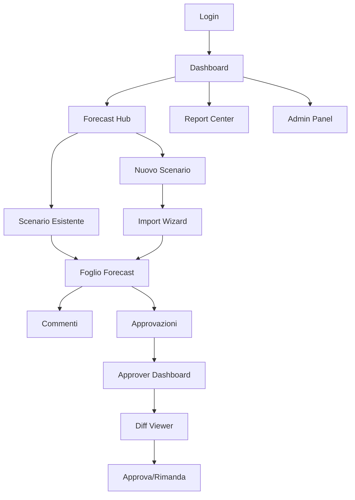

# Documento Requisiti Prodotto - Piattaforma Forecast Aziendale

## 1. Product Overview

**Piattaforma web ESA Forecast** - Soluzione aziendale moderna che sostituisce Excel per la gestione completa del processo di forecast finanziario, dall'immissione dati alla reportistica direzionale.

La piattaforma unifica validazione, collaborazione e approvazioni in tempo reale, eliminando errori manuali e garantendo compliance aziendale. Utilizzata da controller, responsabili business line e management per decisioni strategiche basate su dati accurati e tracciabili.

**Valore aziendale**: Riduzione del 70% del tempo di preparazione forecast, eliminazione errori di versioning, audit trail completo per compliance, e reportistica automatizzata per il board direzionale.

## 2. Core Features

### 2.1 User Roles

| Ruolo        | Metodo Registrazione         | Permessi Principali                                                                               |
| ------------ | ---------------------------- | ------------------------------------------------------------------------------------------------- |
| **Viewer**   | Invito email + registrazione | Consulta KPI, applica filtri, scarica PDF, segue commenti (no modifica dati, no export Excel raw) |
| **Editor**   | Invito email + registrazione | Compila forecast, importa file, gestisce commenti, avvia approvazioni                             |
| **Approver** | Invito email + registrazione | Riceve notifiche, esamina diff, approva/rimanda con note (SLA: 3 giorni)                          |
| **Admin**    | Configurazione iniziale      | Gestisce utenti, ruoli, anagrafiche, regole, backup, log, compliance                              |

### 2.2 Sistema di Autenticazione

**Configurazione Supabase Auth:**

* **Metodo esclusivo**: Email/Password (no SSO, no magic link)

* **Policy Password**: Minimo 8 caratteri, 1 maiuscola, 1 numero

* **Email Verification**: Tramite Supabase Auth SMTP

* **Reset Password**: Email automatica via Supabase

* **Sessioni**: Gestione automatica con refresh token

* **RLS (Row Level Security)**: Implementato per tutti i dati sensibili

### 2.2 Feature Module

La piattaforma di forecast è composta dalle seguenti pagine principali:

1. **Dashboard**: KPI cards animate, heat-map clienti, alert center, barra temporale, ricerca globale
2. **Forecast Hub**: tabella scenari mensili, wizard creazione, gestione stati e completamento
3. **Foglio Forecast**: griglia Excel-like, validazione live, commenti contestuali, color coding
4. **Approvals**: flusso approvazione a due livelli, diff-viewer, gestione SLA e reminder
5. **Report Center**: PDF consolidati, export Excel, dataset BI, distribuzione automatica
6. **Admin Panel**: gestione utenti, anagrafiche, regole validazione, log eventi, compliance
7. **Import Wizard**: caricamento file Excel/CSV, mappatura colonne, validazione dati

### 2.3 Page Details

| Page Name               | Module Name      | Feature Description                                                                                                                                |
| ----------------------- | ---------------- | -------------------------------------------------------------------------------------------------------------------------------------------------- |
| **Login/Registrazione** | Autenticazione   | Valida email/password con policy (8+ char, 1 maiuscola, 1 numero), gestisce registrazione con email verification, reset password via SMTP Supabase |
| **Dashboard**           | KPI Cards        | Mostra Budget Dichiarato/Attivo/Fast Rolling con animazioni, micro-sparklines, scostamenti percentuali                                             |
| **Dashboard**           | Heat-map Clienti | Visualizza top 10 clienti per crescita/decrescita con drill-down interattivo                                                                       |
| **Dashboard**           | Alert Center     | Segnala valori fuori tolleranza (Fast Rolling >10% Attivo, Attivo >5% Dichiarato), soglie configurabili                                            |
| **Dashboard**           | Ricerca Globale  | Cerca clienti, commenti, documenti con shortcut Ctrl+K, risultati real-time                                                                        |
| **Forecast Hub**        | Lista Scenari    | Elenca mesi con stato (Draft/In Review/Approved), percentuale completamento, badge colorati                                                        |
| **Forecast Hub**        | Wizard Creazione | Crea nuovo scenario, clona anagrafiche anno precedente, assegna responsabile BL automatico                                                         |
| **Foglio Forecast**     | Griglia Dati     | Gestisce vista Excel-like con colonne fisse BL/Cliente, blocchi comprimibili, totalizzazioni                                                       |
| **Foglio Forecast**     | Color Coding     | Applica colori celle (giallo=WIP, verde=confermato, rosso=errore, viola=commento)                                                                  |
| **Foglio Forecast**     | Validazione Live | Controlla regole business, aggiorna subtotali <1s, gestisce fino 10k righe <2s                                                                     |
| **Foglio Forecast**     | Sistema Commenti | Gestisce thread con mention, emoji, allegati, risoluzione, overlay preview                                                                         |
| **Import Wizard**       | Upload File      | Drag\&drop Excel/CSV, mappatura colonne memorizzata, anteprima validazione                                                                         |
| **Import Wizard**       | Gestione Errori  | Carica righe valide, isola errori in pannello Anomalie per correzione                                                                              |
| **Approvals**           | Diff Viewer      | Confronta versioni con highlight modifiche, approva/rimanda con note                                                                               |
| **Approvals**           | Workflow SLA     | Gestisce flusso 2 livelli (BL→CFO), reminder automatici dopo 3 giorni                                                                              |
| **Report Center**       | PDF Consolidato  | Genera report mensili automatici, invia a mailing list configurabile                                                                               |
| **Report Center**       | Export Dati      | Esporta Excel raw per analisi, dataset BI formato Parquet                                                                                          |
| **Admin Panel**         | Gestione Utenti  | Invita, sospende, reset utenti, mappatura BL↔utente                                                                                                |
| **Admin Panel**         | Configurazione   | Gestisce anagrafiche, regole validazione, soglie alert, mailing list                                                                               |

## 3. Core Process

### 3.1 Priorità di Sviluppo

**Fase 1: Autenticazione (Settimane 1-2)**

* UI Login/Registrazione con validazione

* Integrazione Supabase Auth

* Implementazione RLS policies

* Gestione sessioni e stati utente

**Fase 2: Foglio Forecast - Cuore dell'App (Settimane 3-6)**

* CRUD operazioni sui dati forecast

* Sistema di calcoli e validazioni live

* Versioning e snapshot

* Sistema commenti e collaborazione

* Import/Export Excel

**Fase 3: Dashboard e Reportistica (Settimane 7-8)**

* KPI cards animate

* Heat-map clienti

* Alert center

* Report center con PDF

### 3.2 Flussi Operativi Principali

**Flusso Editor:**

1. Login → Dashboard personale
2. Forecast Hub → Crea nuovo scenario
3. Import Wizard → Carica dati Excel
4. Foglio Forecast → Validazione e correzioni
5. Sistema commenti → Collaborazione
6. Invio per approvazione

**Flusso Approver:**

1. Login → Notifiche pending
2. Approvals → Diff viewer
3. Approva/Rimanda con note
4. Monitoraggio SLA

## 4. User Interface Design

### 4.1 Design Style

**Brand Identity ESA (Ecologia Soluzione Ambiente)**

**Palette Colori:**

* **Blu ESA (primario)**: #0D3F85 (RGB: 13, 63, 133) - Pulsanti principali, link attivi

* **Bianco**: #FFFFFF (RGB: 255, 255, 255) - Sfondo prevalente, spazi negativi

* **Grigio scuro**: #333333 (RGB: 51, 51, 51) - Testi, icone neutre

* **Nero pieno**: #000000 (RGB: 0, 0, 0) - Micro-tipografia, stroke sottili

* **Rosso prodotto**: #C42024 (RGB: 196, 32, 36) - Highlight funzionali, CTA secondarie

**Tipografia:**

* Font principale: Inter (Google Fonts)

* Scale modulare: 12px, 14px, 16px, 18px, 24px, 32px, 48px

* Line-height ottimizzato: 1.5 per body text, 1.2 per headings

**Componenti UI:**

* Pulsanti: Rounded corners (8px), elevazione sottile

* Cards: Border radius 12px, shadow soft

* Layout: Grid system 8pt, mobile-first approach

* Icone: Lucide React (24px standard, 16px small, 32px large)

**Sistema Spaziature:**

* Base unit: 8px

* Margini: 8px, 16px, 24px, 32px, 48px, 64px

* Padding: 8px, 12px, 16px, 24px, 32px

### 4.2 UX Fluida e Intuitiva

* **Flussi utente**: Percorsi lineari con breadcrumb e navigation chiara, massimo 3 click per qualsiasi azione

* **Feedback immediato**: Loading states, success/error messages, progress indicators per ogni interazione

* **Gestione errori**: Messaggi contestuali non invasivi con suggerimenti di risoluzione

* **Accessibilità**: Focus management, keyboard navigation, screen reader support completo

* **Performance percepita**: Skeleton screens, lazy loading, transizioni smooth per ridurre perceived latency

### 4.3 Responsiveness e Accessibilità

**Design Responsive:**

* **Mobile-first approach** con progressive enhancement

* **Breakpoints**: 320px (mobile), 768px (tablet), 1024px (desktop), 1440px (large)

* **Touch optimization**: Pulsanti min 44px, gesture support per tablet

* **Layout adattivo**: Dashboard, Approvals e Report Center in layout card su mobile

**Accessibilità WCAG AA:**

* Contrasto colori conforme (4.5:1 per testo normale, 3:1 per testo large)

* Focus states evidenziati con outline blu ESA

* Supporto screen-reader con ARIA labels

* Navigazione da tastiera completa

* Skip links per contenuti principali

**Localizzazione:**

* Interfaccia IT/EN con switch dal profilo utente

* Formati data/ora localizzati

* Separatori decimali e migliaia per regione

**Performance:**

* Validazione live < 1 secondo

* Diff-viewer 10k righe < 2 secondi

* Autosave automatico ogni 30 secondi

* Lazy loading per componenti pesanti

* Skeleton screens per perceived performance

## 5. Integrazione Supabase

### 5.1 Backend e API Serverless

* **Supabase Functions**: Edge Functions per logica business complessa (validazioni, calcoli forecast, generazione report)

* **Real-time API**: Subscriptions per aggiornamenti live su modifiche forecast, commenti e approvazioni

* **Row Level Security (RLS)**: Politiche granulari per controllo accesso basato su ruoli e Business Line

* **API REST Auto-generata**: Endpoint automatici per tutte le operazioni CRUD con filtering e pagination

* **Webhooks**: Integrazione con sistemi esterni per notifiche email e sincronizzazione data-lake

### 5.2 Database PostgreSQL

* **Schema Ottimizzato**: Tabelle normalizzate per utenti, forecast, commenti, approvazioni con indici performance

* **Stored Procedures**: Funzioni PL/pgSQL per calcoli complessi e aggregazioni forecast

* **Triggers**: Automazioni per audit trail, notifiche e snapshot automatici

* **Views Materializzate**: Pre-aggregazioni per dashboard KPI e report con refresh incrementale

* **Backup Automatico**: Point-in-time recovery con retention 35 giorni

### 5.3 Autenticazione e Sicurezza

* **Supabase Auth**: Sistema completo con email/password, magic links e SSO aziendale

* **JWT Tokens**: Gestione sessioni sicura con refresh automatico

* **Multi-Factor Authentication**: 2FA opzionale per ruoli Admin e Approver

* **Session Management**: Controllo sessioni attive, logout forzato e timeout configurabile

* **Password Policies**: Requisiti complessità, scadenza e cronologia password

### 5.4 Storage e File Management

* **Supabase Storage**: Bucket organizzati per tipologia (import files, export reports, allegati commenti)

* **File Processing**: Validazione automatica file Excel/CSV con parsing e preview

* **CDN Integration**: Distribuzione globale per performance ottimali

* **Versioning**: Controllo versioni per file importati e snapshot export

* **Security Policies**: Controllo accesso granulare basato su ruoli e ownership

### 5.5 Architettura Scalabile

* **Connection Pooling**: Gestione ottimale connessioni database per performance

* **Caching Strategy**: Redis-compatible caching per query frequenti e sessioni

* **Load Balancing**: Distribuzione automatica carico su edge functions

* **Monitoring**: Dashboard integrato per performance, errori e usage metrics

* **Auto-scaling**: Scaling automatico basato su carico e utilizzo risorse

